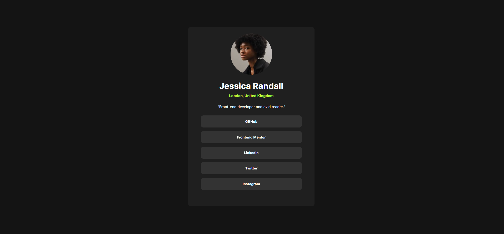

# Frontend Mentor - Recipe page solution

This is a solution to the [Recipe page challenge on Frontend Mentor](https://www.frontendmentor.io/challenges/social-links-profile-UG32l9m6dQ). 

## Table of contents

- [Overview](#overview)
  - [The challenge](https://www.frontendmentor.io/challenges/social-links-profile-UG32l9m6dQ)
  - [Screenshot](./assets/images/web.png)
- [Author](#author)

## Overview

### Screenshot

### Links

- Solution URL: [https://www.frontendmentor.io/solutions/responsive-recipe-page-Z0CEdVe2qq](https://www.frontendmentor.io/solutions/responsive-recipe-page-Z0CEdVe2qq)
- Live Site URL: [https://rugarcia25.github.io/recipe-page-main/](https://rugarcia25.github.io/recipe-page-main/)

### Built with

- Semantic HTML5 markup
- CSS custom properties
- Flexbox
- CSS Grid
- Mobile-first workflow

## Author

- Website - [Rubén Garcia](https://rgdev.netlify.app/)
- Frontend Mentor - [@rugarcia25](https://www.frontendmentor.io/profile/rugarcia25)
- Github - [@rugarcia25](https://github.com/rugarcia25)